# Google Keep Clone
This project is created for educational purposes.  
I have been working on replicating the functionality and visual design of Google Keep.

## Table of Contents
- [Technology Stack and Features](#technology-stack-and-features)
- [User Interface](#user-interface)
- [Architecture](#architecture)
- [Upcoming Features](#upcoming-features)
- [How to run it](#getting-started)

## Technology Stack and Features
- 🧑‍💻 **Backend:**
	- 🧩 Microservices architecture for scalable and maintainable applications.
	- 🔗 RESTful API for efficient interaction between frontend and backend services.
	- 🐍 [Python 3.11](https://www.python.org/).
	- 🌐 [Django 4.2](https://www.djangoproject.com/) as the core web framework.
	- 🛠️ [Django REST Framework (DRF)](https://www.django-rest-framework.org/) for building the API.
	- 🗄️ [PostgreSQL](https://www.postgresql.org/) as the SQL database.
    - ⚡ [Redis](https://redis.io/) for caching.
- 🎨 **Frontend:**
	- 🖥️ HTML, CSS, and JavaScript as the traditional frontend stack.
	- 📦 [Webpack](https://webpack.js.org/) as the module bundler.
	- 📱 Responsive design for mobile and tablet devices.
	- 🌑 Dark mode support.
	- 💾 Local storage to preserve user theme and view preferences.
- 🛠️ **Containerization & Infrastructure:**
	- 🐋 [Docker Compose](https://www.docker.com/) for production environments.
	- 🦄 [Gunicorn](https://gunicorn.org/) as the WSGI HTTP server.
	- 🌐 [Nginx](https://nginx.org/) as the web server.
- 🔑 JWT (JSON Web Token) for authentication.
- ✅ Tests written using `django.test`.
- ⚙️ Environment-specific settings (development, production, etc.) using `.env` files and a `settings/` directory.
- 📄 Deployment instructions using Docker Compose.

## User Interface
### Sign-Up / Sign-In Window
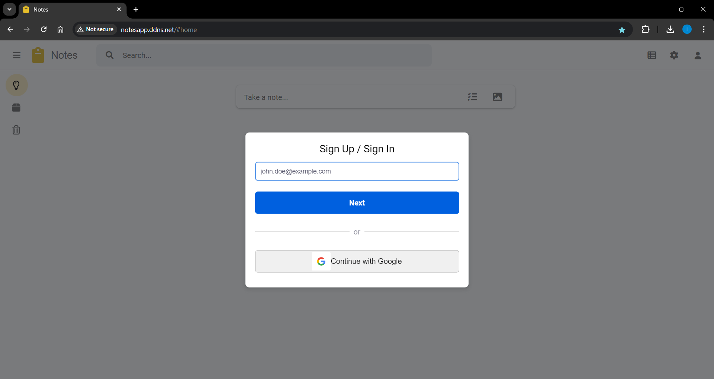

### Registration Prompt (New Email)
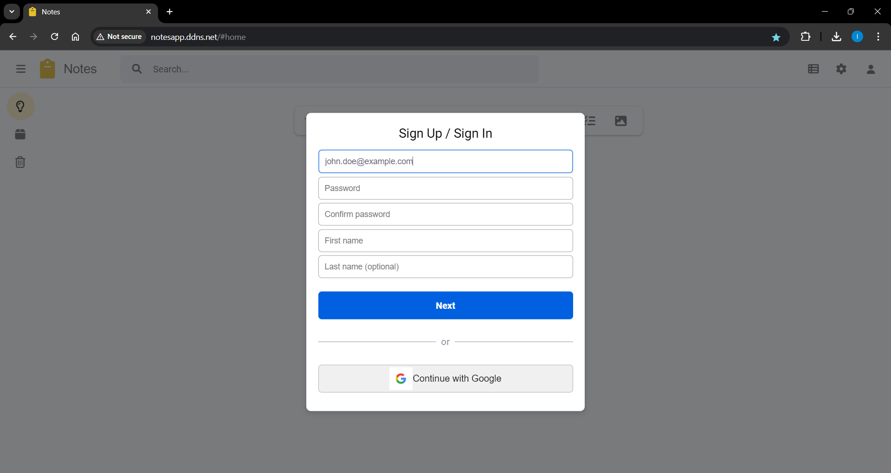

### Login Prompt (Existing Email)
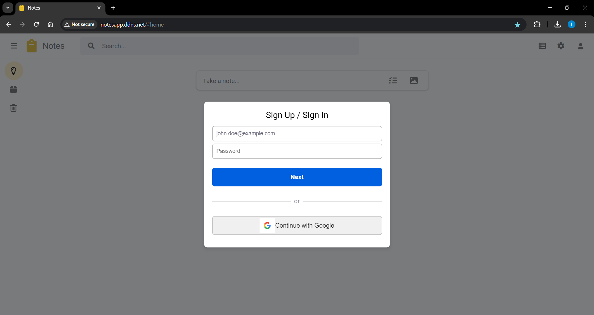

### Logged-In User Info
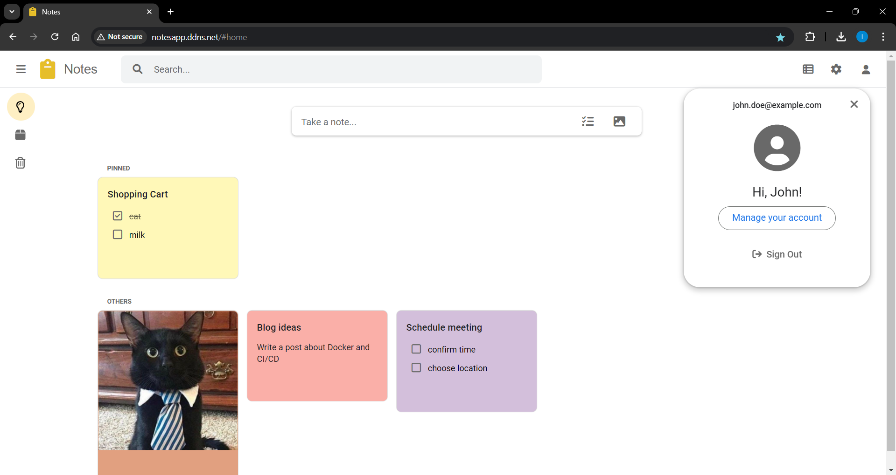

### Creating a Note (GIF)
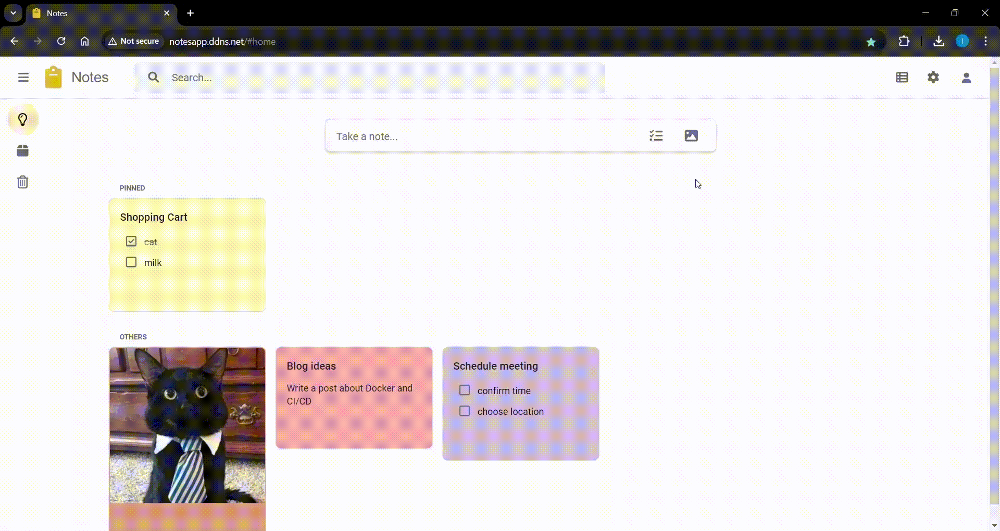

### Editing Notes
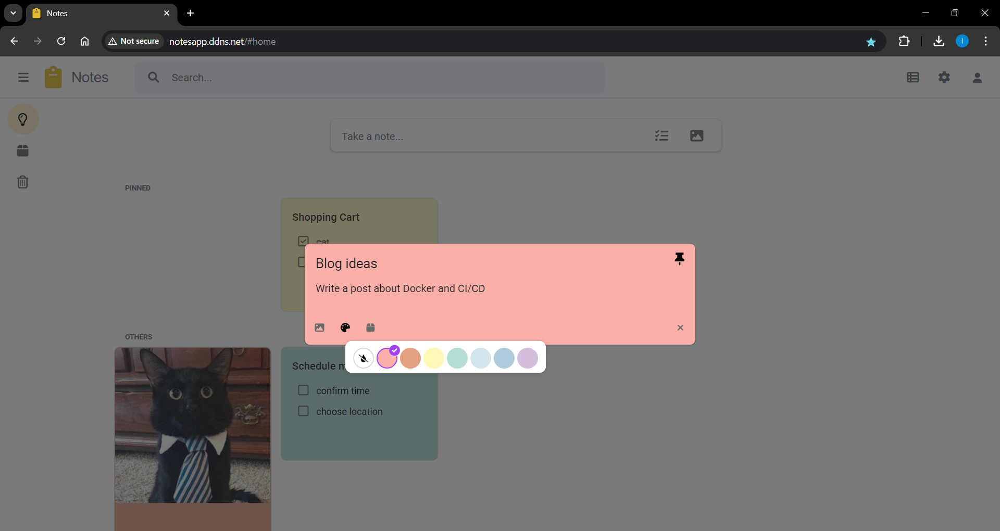

### Archived Notes
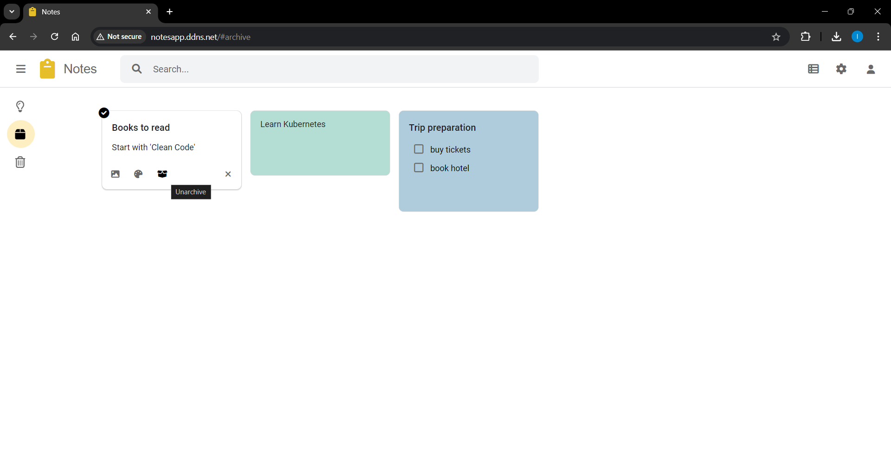

### Trash (Deleted Notes)
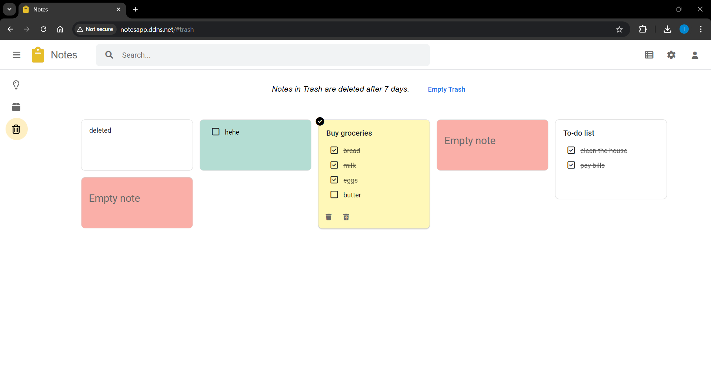

### Select Menu (GIF)
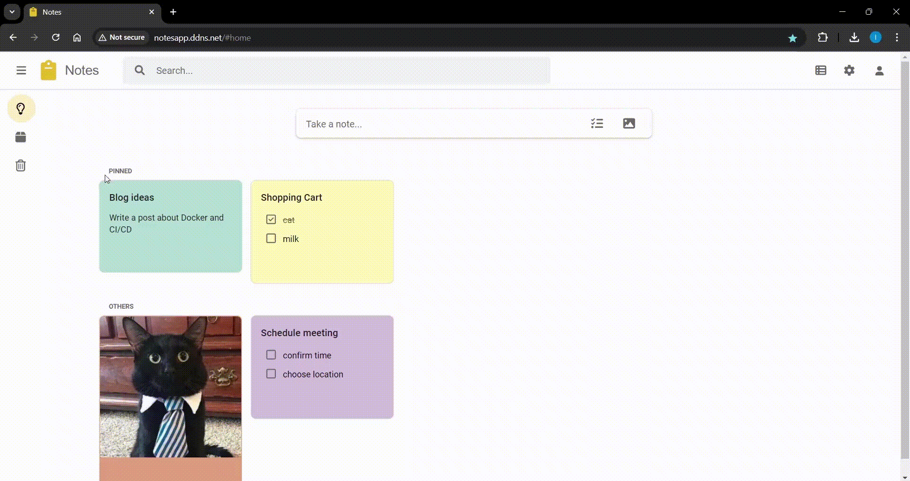

### Searching Notes (GIF)


### List View of Notes
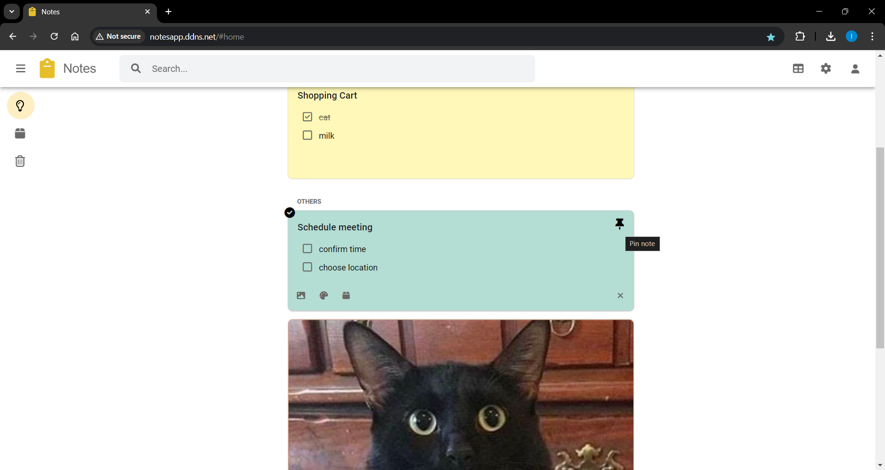

### Dark Theme
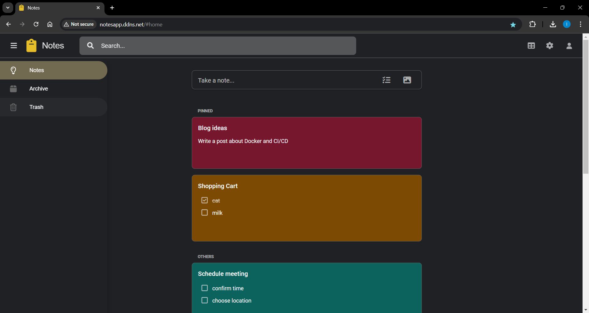

### Mobile Web App
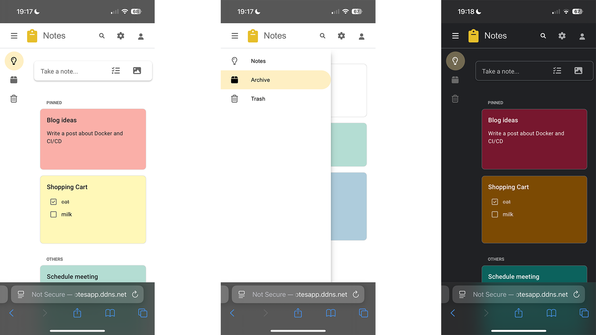

## Architecture
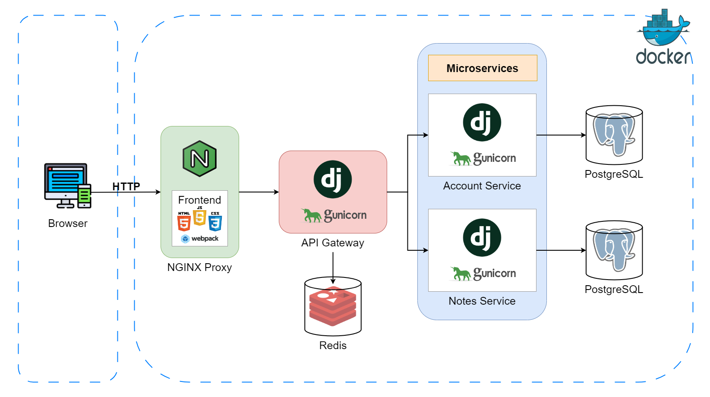

- Gateway and Token Handling:
    - When a request is made to `/api/account/`, the token is forwarded directly as is to the account service, which manages user registration and token issuance.
    - For requests to the notes service, the token requires verification. The gateway middleware first checks if the token has already been verified and cached in Redis, which contains the corresponding user_id. If the token is not found in the cache, it is sent to the account service for validation, and the `user_id` is retrieved and attached to the request before proceeding to the notes service.
- Image Handling for Notes:
    - Images related to notes are currently stored in the `notes_service` under the media directory. Uploading images is handled through the API of the notes_service.
    - Nginx serves these images via an alias to the appropriate folder.
- All interactions with the database are handled via transactions to ensure data consistency and reliability.
- Nginx is currently configured to listen only on `port 80`, meaning that the application is accessible via HTTP without encryption.

## Upcoming Features
- **Security Enhancements**: Strengthen overall security measures.
- **Email Confirmation**: Implement email verification to prevent the use of fake emails during registration.
- **Profile Avatar**: Allow users to upload and manage profile avatars.
- **User Settings**: Add frontend functionality for updating username, password, and email.
- **Trash Cleanup**: Automatically delete items from the trash after 7 days.
- **Google Authentication**: Add support for registration and login using Google OAuth.
- **Search Filters**: Implement search filters by color for notes.
- **React Frontend**: Replace the current frontend with a React-based interface for a more dynamic user experience.
- **Metrics Collection**: Integrate Prometheus for metrics collection and Grafana for visualization.
- **Logging System**: Set up centralized logging with ELK stack (Elasticsearch, Logstash, and Kibana) for text search and visualization.
- **CI/CD**: Implement continuous integration and deployment pipelines using GitHub Actions.
- **Task Queues**: Introduce task queue management, potentially using Celery for background job processing.

## Getting Started
### Prerequisites
Make sure you have the following installed:
- [**Docker**](https://www.docker.com/get-started)

To verify your installation, run:
```bash
docker --version
docker-compose --version
```
Follow the instructions for Docker installation based on your OS.

- [**Node.js and npm**](https://nodejs.org/) (npm comes with Node.js)

To verify installation, run the following commands:
```bash
node -v
npm -v
```
If Node.js is not installed, follow the official installation guide.

### Clone the Git repository
```bash
git clone https://github.com/surmalune/google-keep-clone-django-app.git
```
### Frontend Setup
1. Go to the `frontend/` folder.
```bash
cd frontend
```
2. Install dependencies:  
```bash
npm install
```
This will create `package-lock.json` and the `node_modules/` directory.

3. Create the environment configuration file:  
- Windows:
```bash
copy .env.example .env.prod
```
- Linux/Mac:
```bash
cp .env.example .env.prod
```
4. Fill in the missing variables in the `.env.prod` file.

5. Build the frontend for production:  
```bash
npm run build:prod
```
This will generate the fresh `bundle.js` file in `dist/`.  
### Gateway, Account, and Notes Service Setup
1. In each of the following directories (`gateway`, `account_service`, `notes_service`), create a `.env` file:  
- Windows:
```bash
copy .env.example .env
```
- Linux/Mac:
```bash
cp .env.example .env
```
2. Fill in the missing variables in each of the `.env` files.  
### General Setup
1. In the root directory, create a `.env` file:  
- Windows:
```bash
copy .env.example .env
```
- Linux/Mac:
```bash
cp .env.example .env
```
2. Fill in the missing variables in the `.env` file.  
3. Build and start the services with Docker:  
```bash
docker-compose up --build
```
4. Run migrations for `account` service:  
```bash
docker-compose exec account python manage.py migrate
```
5. Run migrations for `notes` service:  
```bash
docker-compose exec notes python manage.py migrate
```
### Accessing the Application
The application will be accessible at the domain specified in the `SERVER_NAME` variable in your `.env` file.  
Note: Make sure to configure `ALLOWED_HOSTS` and `CORS_ALLOW_ORIGINS` correctly to avoid any issues.  